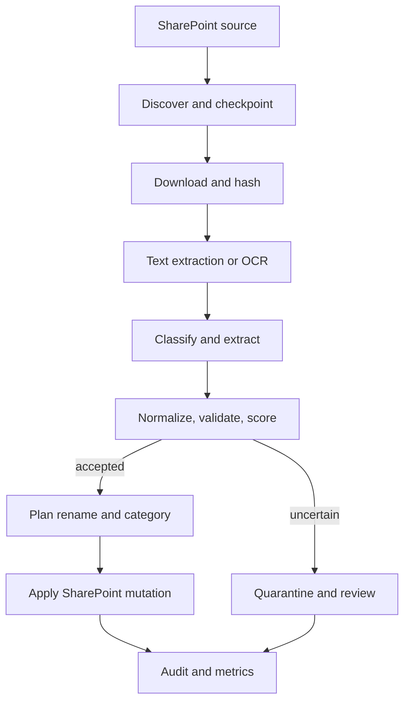

# Financial Document Extraction and SharePoint Reclassification

## Project plan

**Status:** Proposed  
**Target:** Open-source, local-first repository  
**Initial document type:** Invoices  
**Estimated MVP:** 5–6 weeks for one senior engineer, assuming SharePoint access and a representative evaluation set are available in week 1

## 1. Executive recommendation

Build a deterministic, auditable document-processing pipeline around a replaceable extraction engine:

1. Discover eligible files in SharePoint.
2. Download each immutable source to a local working directory.
3. Extract native PDF text, falling back to OCR only when required.
4. Classify the document and extract a versioned set of financial entities.
5. Validate, normalize, and score the result.
6. Render a controlled filename from a versioned naming policy.
7. Rename and optionally move the original SharePoint item using Microsoft Graph.
8. Persist an audit record keyed by the SharePoint item identity and content hash.

The core must run without SharePoint and without a hosted model. SharePoint, OCR, and model providers should be adapters behind narrow interfaces.

The initial five invoice fields should be:

| Field ID | Type | Required | Notes |
|---|---|---:|---|
| `invoice_number` | string | yes | Preserve semantic punctuation; normalize whitespace only. |
| `organization_name` | string | yes | The invoice issuer/supplier, not the recipient. |
| `invoice_date` | ISO date | yes | Normalize to `YYYY-MM-DD`; retain raw value and provenance. |
| `total_amount` | decimal | yes | Never represent money as floating point. |
| `currency` | ISO 4217 code | yes | Infer only when evidence is unambiguous; otherwise quarantine. |

`document_type`, `purchase_order_number`, `due_date`, tax/VAT number, and recipient organization should be supported as optional fields from the start. `document_type` is pipeline metadata rather than one of the five invoice entities.

Recommended default filename:

```text
{invoice_date}_{organization_slug}_{document_type}_{invoice_number}.{extension}
```

Do not place `total_amount` in the default filename. Amount corrections would create unnecessary renames, and filenames should remain short and operationally stable. Store the complete extraction in the audit database and, if useful, SharePoint columns.

## 2. Goals and non-goals

### Goals

- Extract the configured financial entities from PDF and common image formats.
- Run locally with open-source components and no document content leaving the machine by default.
- Make extraction schemas, naming templates, category rules, and confidence thresholds configurable and versioned.
- Rename and recategorize SharePoint files safely and idempotently.
- Provide evidence for every extracted value: page, source span or bounding box, extraction method, and confidence.
- Support dry-run, replay, quarantine, and rollback-friendly operation.
- Measure extraction quality separately from operational pipeline reliability.

### Non-goals for MVP

- General-purpose extraction from every financial document type.
- Invoice line-item extraction.
- Training a custom model before a baseline and error distribution exist.
- Fully autonomous mutation of low-confidence or ambiguous documents.
- Using filenames as the system of record for extracted metadata.

## 3. Architecture



### Component boundaries

| Component | Responsibility | Important contract |
|---|---|---|
| `source` | Discover, download, rename, move, and attach metadata | Operates on stable `drive_id` + `item_id`, not paths alone. |
| `document` | MIME detection, PDF parsing, page rendering, OCR routing | Produces page text and positional evidence. |
| `classifier` | Identify document type/category | Returns calibrated scores and policy version. |
| `extractor` | Produce entity candidates | Provider-neutral structured result; no file mutation. |
| `validator` | Normalize and enforce cross-field constraints | Returns accepted, review, or rejected with reason codes. |
| `policy` | Render filename and destination category | Pure function over validated metadata and config version. |
| `orchestrator` | State machine, retries, idempotency, concurrency | At-least-once execution with exactly-once effective mutation. |
| `audit` | Store provenance, state transitions, hashes, and outcomes | Append-only events plus current projection. |

### Extraction strategy

Use a hybrid cascade rather than beginning with fine-tuning:

1. Native text extraction with PyMuPDF for digitally generated PDFs.
2. OCR fallback with OCRmyPDF/Tesseract when text coverage or quality is below threshold.
3. Deterministic candidates for dates, currency, totals, and known invoice labels.
4. A replaceable structured extractor:
   - baseline: rules and supplier templates;
   - optional local model: a constrained local LLM or document model adapter;
   - future: trained layout-aware model once labelled error data justifies it.
5. Cross-field validation and confidence calibration.

The extractor must return candidate values with evidence, not only a final JSON object. Confidence should drive workflow policy; it should not be treated as a trustworthy probability until calibrated on the target corpus.

## 4. Configuration model

Use versioned YAML for fields and policies. Use Python enums only for closed operational states and supported category identifiers.

```yaml
schema_version: invoice-v1
document_type: invoice
fields:
  - id: invoice_number
    type: string
    required: true
  - id: organization_name
    type: organization
    required: true
  - id: invoice_date
    type: date
    required: true
  - id: total_amount
    type: decimal
    required: true
  - id: currency
    type: currency
    required: true

naming:
  template: "{invoice_date}_{organization_slug}_{document_type}_{invoice_number}.{extension}"
  max_length: 180
  collision_strategy: content_hash_suffix

categories:
  - id: supplier_invoices
    destination: "Finance/Invoices/{invoice_date:%Y}/{invoice_date:%m}"
    when: "document_type == 'invoice'"

thresholds:
  auto_apply: 0.94
  manual_review: 0.75
```

Internally validate this configuration with Pydantic or JSON Schema. Store `schema_version`, `policy_version`, and extractor version with every run so historical outputs can be reproduced.

## 5. SharePoint integration design

Use Microsoft Graph through an explicit `SharePointSource` adapter.

### Authentication

- Development: delegated device-code authentication.
- Production/unattended use: Entra ID application identity with certificate-based credentials.
- Request the narrowest site-scoped permissions possible; do not assume tenant-wide file access.
- Never commit tenant IDs, client IDs tied to a customer, tokens, certificates, or document samples.

### Processing semantics

- Discover files from configured site, drive, and source folders.
- Persist Graph delta tokens where supported to avoid full rescans.
- Use the SharePoint `driveItem` ID as identity; paths and filenames are mutable attributes.
- Hash downloaded bytes with SHA-256. The idempotency key should include source identity, item version/eTag, content hash, and policy version.
- Check the current eTag before mutation. If it changed after download, abandon the mutation and requeue.
- Rename/move only after validation and collision checks.
- Apply mutations using a dry-run plan first. Log old path, proposed path, reason, and policy version.
- On a partial failure, preserve enough state to retry safely. Never infer success from a local filename.

### Recategorization precedence

1. Validated extracted metadata for newly processed files.
2. A strict parser for legacy filenames matching a known naming-policy version.
3. Existing SharePoint metadata if its provenance is trusted.
4. Quarantine/manual review when sources disagree or no rule matches.

This avoids circular logic where a bad historical filename becomes accepted truth.

## 6. Repository structure

```text
financial-document-extractor/
├── pyproject.toml
├── README.md
├── LICENSE
├── CONTRIBUTING.md
├── SECURITY.md
├── configs/
│   ├── schemas/invoice-v1.yaml
│   └── policies/default-v1.yaml
├── src/finextract/
│   ├── cli.py
│   ├── domain/
│   │   ├── models.py
│   │   ├── enums.py
│   │   └── errors.py
│   ├── sources/
│   │   ├── base.py
│   │   ├── local.py
│   │   └── sharepoint.py
│   ├── documents/
│   ├── extraction/
│   ├── validation/
│   ├── policies/
│   ├── orchestration/
│   └── audit/
├── tests/
│   ├── unit/
│   ├── integration/
│   ├── contract/
│   └── evaluation/
├── evals/
│   ├── manifests/
│   └── README.md
├── docs/
│   ├── architecture.md
│   ├── threat-model.md
│   └── operations.md
└── docker/
```

Recommended initial interface:

```bash
finextract plan --source local --input ./samples --config ./configs/policies/default-v1.yaml
finextract apply --plan ./runs/2026-08-24/plan.json
finextract sync --source sharepoint --dry-run
finextract evaluate --manifest ./evals/manifests/invoice-v1.jsonl
```

`plan` and `apply` must be separate operations. This is the primary protection against destructive renaming at scale.

## 7. Delivery plan

### Phase 0 — Discovery and evaluation contract (2–3 days)

**Deliverables**

- Confirm the five required fields and filename/category policies with stakeholders.
- Collect 200–500 representative, legally usable invoices spanning suppliers, scans, digital PDFs, languages, currencies, and failure cases.
- Define annotation guidelines and a JSONL golden-set format with entity evidence.
- Establish baseline metrics and privacy constraints.
- Confirm SharePoint tenant, site, document library, permissions, volume, and mutation expectations.

**Exit gate**

- A signed-off schema and naming policy.
- At least 50 adjudicated documents for early development and a held-out set that developers cannot tune against.

### Phase 1 — Core local pipeline (week 1)

**Deliverables**

- Python package, CLI, config loading, domain models, structured logging.
- Local filesystem source adapter.
- MIME validation, native PDF text extraction, OCR fallback.
- Content hashing, run manifest, and SQLite audit store.
- Dry-run plan artifact.

**Exit gate**

- Reprocessing the same input and config produces the same plan.
- Corrupt, encrypted, empty, and unsupported files fail with explicit reason codes.

### Phase 2 — Extraction, validation, and naming (weeks 2–3)

**Deliverables**

- Invoice classifier and five-field extractor baseline.
- Normalizers for dates, organizations, decimals, and ISO currencies.
- Evidence capture and cross-field validation.
- Filename renderer with character sanitization, reserved-name handling, length limits, and deterministic collision suffixes.
- Category rules and legacy filename parser.
- Evaluation harness and error taxonomy.

**Exit gate**

- Required-field exact-match targets met on the held-out set.
- No invalid or colliding proposed names in adversarial tests.
- Low-confidence documents are quarantined, never silently renamed.

### Phase 3 — SharePoint adapter (week 4)

**Deliverables**

- Graph authentication flows and site/drive discovery configuration.
- Incremental discovery, download, eTag concurrency checks, rename, move, and metadata update.
- Contract tests using a dedicated non-production document library.
- Retry policy for throttling, transient errors, and token expiration.

**Exit gate**

- Dry-run against the target library produces a reviewable mutation plan.
- Replaying a completed run causes zero additional mutations.
- Concurrent source modification is detected and does not overwrite user changes.

### Phase 4 — Hardening and controlled pilot (week 5)

**Deliverables**

- Security/threat model, dependency scanning, secret scanning, and software bill of materials.
- Operational metrics, quarantine workflow, run summary, and rollback/runbook documentation.
- Pilot on 100–500 files with human approval before apply.
- Error review and threshold calibration.

**Exit gate**

- Zero wrong-file overwrites or lost documents.
- All mutations trace to a source version, extraction evidence, and approved policy.
- Pilot accuracy and review-rate targets are met.

### Phase 5 — Release and scale (week 6)

**Deliverables**

- `v0.1.0` open-source release, examples using synthetic documents, Docker image, and contributor documentation.
- Bounded worker concurrency and SharePoint rate-limit controls.
- Scheduled execution guidance for cron/systemd/container platforms.
- Production rollout from approval-required mode to selective auto-apply.

## 8. Initial backlog

| Priority | Epic | Key stories |
|---:|---|---|
| P0 | Schema and policy | Versioned fields, filename template, categories, validation, config migration rules. |
| P0 | Document ingestion | MIME sniffing, hashing, PDF text, image rendering, OCR quality routing. |
| P0 | Extraction | Candidate generation, structured output, evidence, confidence, provider interface. |
| P0 | Safety | Plan/apply split, idempotency, eTag checks, collision handling, quarantine. |
| P0 | Evaluation | Golden set, per-field scoring, document-level pass rate, error taxonomy. |
| P0 | SharePoint | Auth, discovery, delta sync, download, rename/move, throttling and retry. |
| P1 | Review workflow | Export review queue, corrections, re-run corrected documents. |
| P1 | Metadata | Write approved fields to SharePoint columns where configured. |
| P1 | Observability | Structured events, latency, OCR rate, failure/review rates, drift slices. |
| P2 | Supplier templates | High-precision rules for frequent suppliers. |
| P2 | Model improvement | Active-learning export and optional layout-aware trained model. |

## 9. Quality and evaluation

### Extraction metrics

- Exact match by field after normalization.
- Character error rate for invoice number and organization name.
- Date exact match.
- Amount exact match using decimal and currency as a compound value.
- Document-level all-required-fields-correct rate. This is the primary automation metric.
- Coverage at auto-apply threshold and error rate among auto-applied documents.

Initial release targets should be treated as hypotheses until the corpus is measured:

- `>= 99.5%` correctness among automatically applied documents.
- `>= 80%` auto-apply coverage on in-domain invoices.
- `100%` routing of missing/ambiguous required fields to review.
- `0` overwrite, silent collision, or non-idempotent mutation defects.

### Required test layers

- Unit tests for normalization, validation, filename rendering, and policy evaluation.
- Property-based tests for arbitrary Unicode, path separators, reserved names, length limits, and decimal/date formats.
- Golden-file tests for OCR and extraction outputs, with explicit version-update workflow.
- Contract tests for each source/extractor adapter.
- SharePoint integration tests in an isolated site.
- End-to-end replay tests covering crash points before and after each external mutation.
- Evaluation slices by supplier, scan quality, document length, language, currency, and extraction route.

## 10. Operational data model

At minimum, persist:

- run ID and timestamps;
- source type, drive ID, item ID, original path, eTag/version;
- content SHA-256 and MIME type;
- document type and classification score;
- raw and normalized entity values;
- evidence locations and per-field confidence;
- schema, policy, OCR, and extractor versions;
- proposed and final path/category;
- validation/review reason codes;
- every state transition and external mutation result.

Retain no extracted document text by default beyond the run unless explicitly configured. Audit metadata and evidence pointers should follow the organization's retention policy.

## 11. Principal risks and mitigations

| Risk | Consequence | Mitigation |
|---|---|---|
| Wrong supplier/recipient interpretation | Systematic misnaming | Explicit role definition, evidence requirement, supplier registry, cross-field checks. |
| OCR hallucination or poor scans | Incorrect financial values | OCR quality gate, multiple candidates, strict validation, manual review. |
| Model confidence is uncalibrated | Unsafe auto-apply | Calibrate on held-out data; use correctness-at-coverage curves. |
| Filename becomes the database | Metadata loss and brittle migrations | Persist structured audit metadata and optional SharePoint columns. |
| SharePoint item changes mid-run | User work overwritten | Stable item IDs, eTag checks, requeue on conflict. |
| Duplicate names | Overwrite or ambiguous records | Preflight lookup and deterministic content-hash suffix; never overwrite. |
| Partial rename/move failure | Inconsistent category/path | Explicit state machine, idempotent retries, recorded mutation result. |
| Tenant-wide permissions | Excessive blast radius | Site-scoped permissions and dedicated service principal. |
| Evaluation leakage | Inflated quality claims | Frozen held-out set and supplier/time-based splits. |
| Open-source leakage | Customer data or secrets committed | Synthetic fixtures, secret scanning, data contribution policy. |

## 12. Definition of done for MVP

The MVP is done when:

1. A clean checkout runs locally from documented commands and processes synthetic samples without cloud services.
2. Field schema, naming policy, categories, and thresholds can change without editing extraction code.
3. Every proposed rename includes validated fields, evidence, source identity, content hash, and versioned policy.
4. Dry-run output is human-reviewable and `apply` consumes an immutable plan.
5. SharePoint integration is idempotent, detects source changes, respects throttling, and never overwrites name collisions.
6. Low-confidence and inconsistent documents enter quarantine with actionable reason codes.
7. The held-out evaluation report includes per-field quality, all-fields-correct rate, coverage at threshold, and slice failures.
8. A controlled pilot completes with no lost files, wrong overwrites, or unexplained mutations.

## 13. Decisions required before implementation

These decisions should be resolved in Phase 0, but they do not block repository scaffolding:

1. Confirm whether `total_amount` and `currency` are the intended fourth and fifth entities, or whether due date/PO number should replace either.
2. Define “organization name”: supplier/issuer, recipient, or both.
3. Confirm whether recategorization means moving files into SharePoint folders, updating SharePoint metadata, or both.
4. Provide the canonical naming convention and examples of legacy naming conventions.
5. Confirm supported document types, languages, currencies, volume, file-size limits, and latency expectations.
6. Decide whether unattended SharePoint mutation is allowed, and which team owns approval of the app registration and site permissions.
7. Define the acceptable auto-rename error rate. For financial records, the recommendation is no more than 0.5% on the automatically applied subset, with the initial production release requiring human approval.
